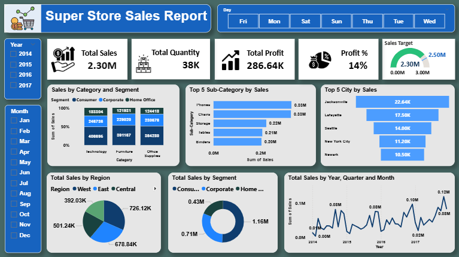

# 📊 Super Store Sales Report – Power BI Dashboard

## 📌 Project Overview
This project is an interactive **Power BI Sales Dashboard** created using the Super Store dataset.  
The dashboard provides insights into:

- Total Sales
- Total Quantity
- Total Profit
- Profit Percentage
- Sales by Category & Segment
- Top Sub-Categories by Sales
- Top Cities by Sales
- Regional Sales Distribution
- Monthly & Yearly Sales Trends

The dashboard helps businesses analyze sales performance and make data-driven decisions.

---

## 🛠 Tools Used
- Microsoft Power BI
- DAX
- Data Modeling
- Data Visualization

---

## 📂 Project Structure

```bash
├── Dashboard/
│   └── Super Store Sales Report.pbix
│
├── Data/
│   └── Super Store Sales Report.xlsx
│
├── Images/
│   └── dashboard.png
│
└── README.md
```

---

## 📷 Dashboard Preview



---

## 📈 Dashboard Features

### KPI Cards
- Total Sales
- Total Quantity
- Total Profit
- Profit %

### Interactive Filters
- Year Filter
- Month Filter
- Day Filter

### Visualizations
- Sales by Category and Segment
- Top 5 Sub-Categories by Sales
- Top 5 Cities by Sales
- Sales by Region
- Sales by Segment
- Sales Trend Analysis

---

## 📊 Key Insights
- Technology category generated the highest sales.
- Consumer segment contributed the largest share of sales.
- West region performed better compared to other regions.
- Sales showed steady growth from 2014 to 2017.

---

## 🚀 How to Use
1. Download the repository.
2. Open the `.pbix` file in Power BI Desktop.
3. Refresh the dataset if required.
4. Explore the interactive dashboard.

---

## 📁 Files Included

| File Name | Description |
|---|---|
| Super Store Sales Report.pbix | Power BI Dashboard File |
| Super Store Sales Report.xlsx | Dataset |
| dashboard.png | Dashboard Screenshot |

---

## 👤 Author
**Kailash Kumar**

- Aspiring Data Analyst
- Skilled in Excel, SQL, Python, Power BI & Tableau

---
